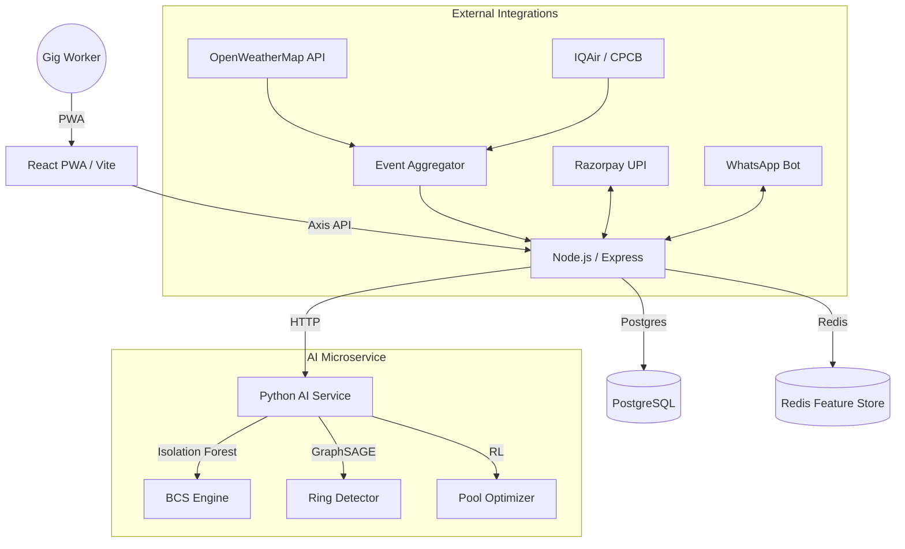

# GigShield System Architecture 🛡️

GigShield is built as a high-availability, AI-driven monorepo designed for real-time parametric insurance.

## 🏗️ High-Level Component Overview

## 📂 Repository Structure

- `/frontend`: React + TypeScript PWA. Uses Zustand for lightweight global state.
- `/backend`: Node.js + Express + BullMQ. Focuses on transaction integrity and UPI orchestration.
- `/ml-service`: Python + FastAPI. Real-time inference for fraud and risk.
- `/infra`: Docker Compose configuration and environment templates.

## ⚡ Tech Stack

| Layer | Technology |
|---|---|
| **Frontend** | React, Vite, Tailwind CSS, i18next (Hindi/English), Zustand, Workbox (PWA) |
| **Backend** | Node.js (Express), TypeScript, PostgreSQL, Redis, BullMQ |
| **AI/ML** | Python (FastAPI), Scikit-learn (Isolation Forest), NetworkX (GNN), NumPy |
| **Integrations** | Razorpay (UPI), Twilio (WhatsApp), OpenWeatherMap, IQAir |

## 🛡️ Core Innovation: The Storm Exception Protocol (SEP)

The SEP is our unique "Proof of Integrity" for gig workers. Unlike traditional insurance that relies on damage reports, the SEP uses:
1. **Parametric Triggers**: Automatic activation based on hyperlocal weather data.
2. **Behavioral Credibility (BCS)**: 12-signal scoring to prove the worker was actually "out in the storm" (via GPS drift, altitude, and sensor variance).
3. **Graph-based Ring Detection**: Real-time GNN analysis to block coordinated fraud rings from exploiting triggers.

## 📈 Scalability

The system is designed to handle 10,000+ concurrent claims per zone. All compute-intensive AI tasks are offloaded to the FastAPI microservice, while the Node.js backend maintains a non-blocking event loop for UPI payout execution.
